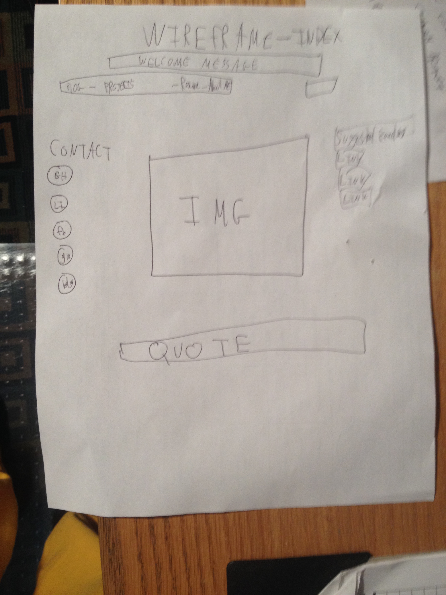
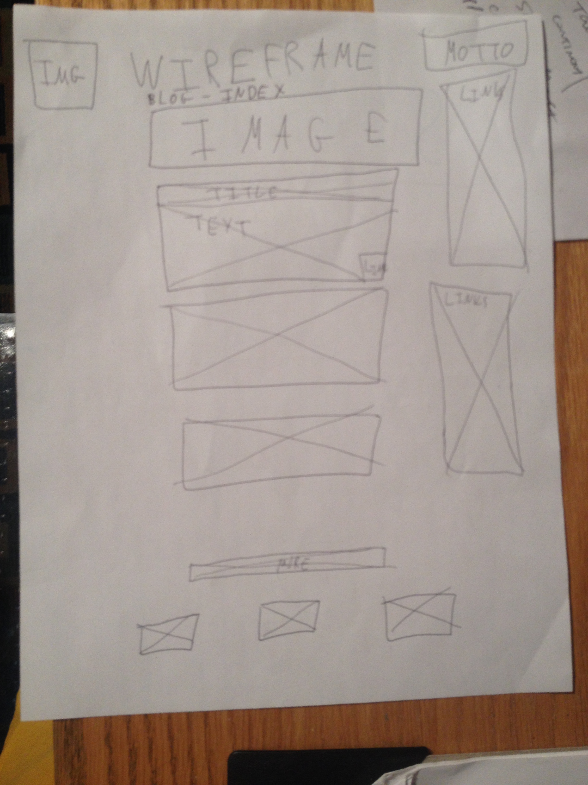

Q: What is a wireframe?

A: Wrieframes displays the sekelton of the website and what functions will be available an din what place on the page they will pbe placed.

Q: What are the benefits of wireframing?

A: Saves time in the design process. Gives an idea of how the site will look.

Q: Did you enjoy wireframing your site?

A: Not really. I struggled with the sites so I just drew it by hand. 

Q: Did you revise your wireframe or stick with your first idea? 

A: Revised. And I will definitely revise it more in the future. I just drew out a really basic sketch.

Q: What questions did you ask during this challenge? What resources did you find to help you answer them?

A: None yet

Q: Which parts of the challenge did you enjoy and which parts did you find tedious?

A: I tried a few different wireframe creation site's from the recommended list. didn't like any of them. reading about ux design was pretty cool.

