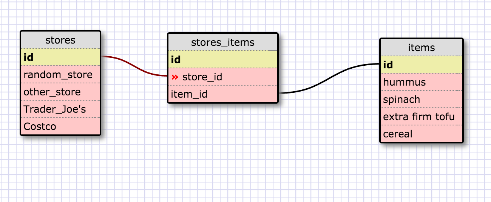

What is a one-to-one database?
	- Two tables that are linked only to each other.
When would you use a one-to-one database? 
	-Whenever there is a unique binary relationship. 
What is a many-to-many database?
	-A database that is linked but in which each table also links to other tables.
When would you use a many-to-many database? 
	- Pretty much all the time. Teams or bands and stadiums/arenas. 
What is confusing about database schemas? What makes sense? 
	-One to many makes sense. I'm a tiny bit not sure about the naming conventions though. Do foreign keys always need to have something_id at the end. Is it just useful in these examples?
	In the many to many, even if I make a list for each store-  I only need the two fields in the Join table, right?
	-I should change the field potus_id to president_id. but since I didn's ave the schema from the site and don't want to make a whole new one. We will just make a note here to remember to always have the key names match.

